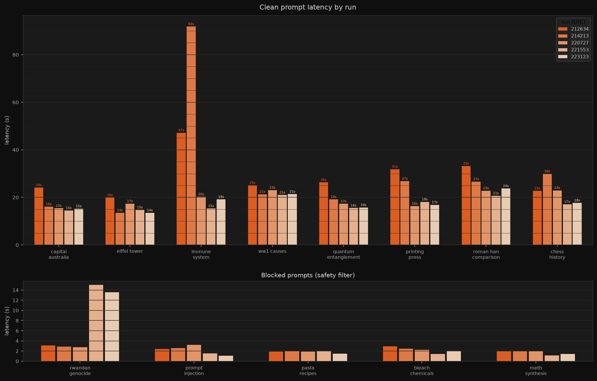

# WikiSearch

A terminal chat app witten in and for MacOS that answers questions using Wikipedia, powered by Anthropic's Claude. Ask it anything — it searches Wikipedia, reads the relevant article, and returns a grounded answer with sources.



---

## Prerequisites

### 1. Homebrew
If you don't have Homebrew, install it from [brew.sh](https://brew.sh). It's a one-line command in your terminal.

### 2. Python & UV
WikiSearch uses [UV](https://docs.astral.sh/uv/) to manage Python and dependencies.

```bash
brew install uv
```

UV will automatically download the correct Python version when you first run the app — nothing else needed.

### 3. API Keys

You need accounts and API keys for two services:

| Service | Purpose | Get a key |
|---|---|---|
| [Anthropic](https://console.anthropic.com) | Powers the AI | Console → API Keys |
| [LangFuse](https://cloud.langfuse.com) | Tracing & prompt management | Settings → API Keys |

Once you have them, copy the file called `.env.sample` and rename to be `.env`. Place your keys in that file accordingly. 

```

### 4. Prompts

WikiSearch pulls its prompts from LangFuse, but has local fallbacks. Push them once before running the app:

```bash
uv run python playground/push_prompts.py
```

---

## Running the app

```bash
uv run python -m app
```

Type any Wikipedia question and press Enter. A few commands are available in the app:

| Command | Description |
|---|---|
| `/help` | Show available commands |
| `/eval all` | Run the full eval set inside the TUI |
| `/eval harms` | Run only the harmful/misuse eval prompts |
| `/exit` | Quit |

---

## Playground scripts

These live in `playground/` and run outside the TUI, useful for prompt tuning and evaluation.

```bash
# Push local prompts to LangFuse (only pushes changed ones)
uv run python playground/push_prompts.py

# Run the full eval set and save results to eval/runs/
uv run python playground/eval_runner.py

# Run only harmful/misuse prompts
uv run python playground/eval_runner.py harms

# Run only clean prompts
uv run python playground/eval_runner.py clean
```

Eval results are saved to `eval/runs/` as JSON and latency is tracked in `eval/latency.csv`.
